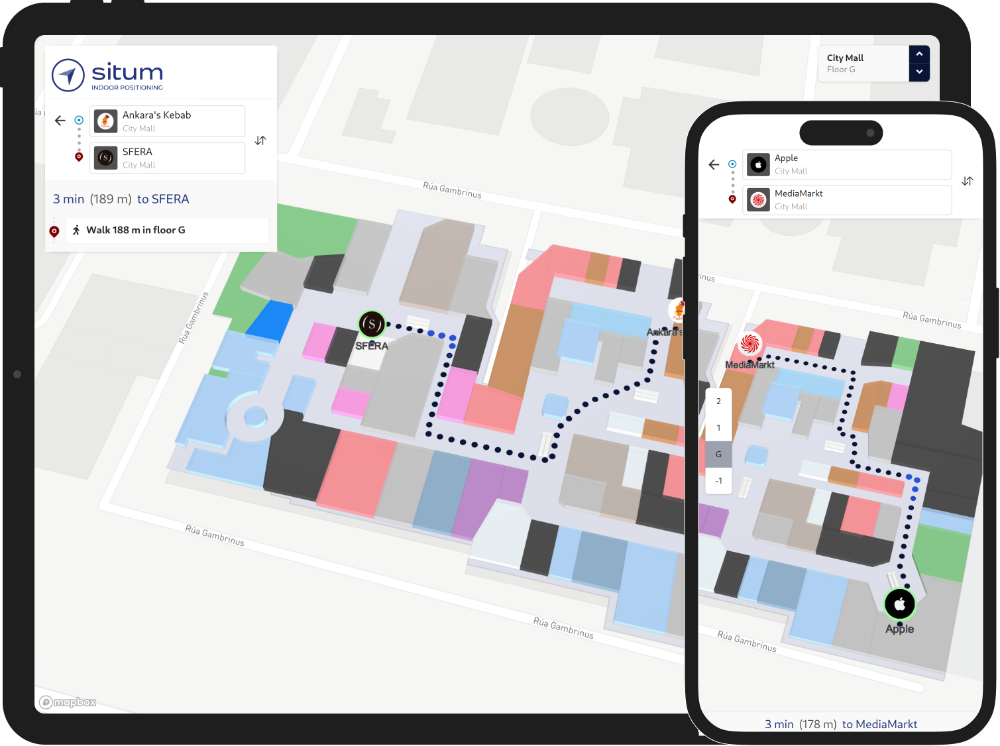

<p align="center">  <h1 align="center">@situm/react-native</h1> </p>

<p align="center" style="text-align:center">

[Situm Wayfinding](https://situm.com/wayfinding) for React Native. Integrate plug&play navigation experience with indoor maps, routes and turn-by-turn directions in no time. With the power of [Situm](https://www.situm.com/).

</p>

<div align="center" style="text-align:center">

[](https://opensource.org/licenses/MIT)


[](https://github.com/ellerbrock/typescript-badges/)


</div>

## Introduction

Situm React Native Plugin is a set of utilities that allow any developer to build React Native location based apps using [Situm](https://www.situm.com/)'s indoor positioning system.

This plugin has two parts:

-   The base SDK, the building blocks that allow you to:

    -   obtain information related to buildings where Situm's positioning system is already configured: floorplans, points of interest, geotriggered events, etc.
    -   retrieve the location of the smartphone inside these buildings (position, orientation, and floor where the smartphone is).
    -   compute a route from a point A (e.g. where the smartphone is) to a point B (e.g. any point of interest within the building).
    -   trigger notifications when the user enters a certain area.

-   A full featured and easy to integrate React Native component that allows you to:
    -   show your cartography on a map
    -   show the user location on the map
    -   calculate point-to-point wayfinging routes
    -   explore points of interest on your buildings on the map




<!-- ## Table of contents

- [Setup your account](#setup-your-account)
- [Installing pre-requisites](#installing-pre-requisites)
- [Using the Plugin](#using-the-plugin)
  - [Getting Started](#getting-started)
  - [Accessing plugin object](#accessing-plugin-object)
  - [Methods](#methods)
- [Submitting Contributions](#submitting-contributions)
- [License](#license)
- [More information](#more-information)
- [Support information](#support-information) -->

## Getting started

There is a comprehensive tutorial on how to set-up a new application using this plugin on the Situm [documentation page](https://situm.com/docs/a-basic-react-native-app/).

Below you will find the basic steps to install and configure the plugin on your React Native project. These steps have already been done for you in the example application of this repository, but they are required for other projects.

## Running the example

Check the [example/README](./example/README.md) file of this repository to create your first React Native application using Situm React Native. In this example app you will find example screens for each method the plugin exposes.

### Configure the plugin on your React Native project

#### Install the plugin

Firstly you need to setup react-native development environment. To get started please follow instructions under section **React Native CLI Quickstart** on this [guide.](https://reactnative.dev/docs/environment-setup)

To add the Situm dependency to your React Native project, you can use the `yarn` or `npm` command. To add this dependency to your project, you can use the following command in your terminal:

```shell
yarn add @situm/react-native react-native-webview react-native-permissions

#OR

npm install --save @situm/react-native react-native-webview react-native-permissions
```

#### Set up your Situm credentials

Create a new `situm.tsx` file with your Situm credentials. You can use the contents of [example/src/situm.tsx](./example/src/situm.tsx) as example.

Follow the [Wayfinding guide](https://situm.com/docs/first-steps-for-wayfinding/) if you haven't set
up a Situm account.

#### Android

1. Add the `ACCESS_FINE_LOCATION` permission to your `AndroidManifest.xml` file if you have configured Situm SDK to [use GPS](<https://developers.situm.com/sdk_documentation/android/javadoc/latest/es/situm/sdk/location/locationrequest#useGps()>):

```xml
  <uses-permission android:name="android.permission.ACCESS_FINE_LOCATION" />
```

3. Set the `minSdkVersion` to 21 or later on your app's `build.gradle` file.

#### iOS

1. Add depedency in `PodFile`

```ruby
  target 'YourApp' do

    pod 'ReactNativeSitumPlugin', :path => '../node_modules/@situm/react-native/ReactNativeSitumPlugin.podspec'

  end
```

You may need to add a Header Search Path: ([screenshot](https://reactnative.dev/docs/linking-libraries-ios.html#step-3))

```bash
  $(SRCROOT)/../node_modules/@situm/react-native/lib/ios
```

2. Declare the following permissions in your app's `Info.plist` file to successfully start positioning:

```xml
<key>NSLocationWhenInUseUsageDescription</key>
<string>Location is required to find out where you are</string>
<key>NSLocationAlwaysAndWhenInUseUsageDescription</key>
<string>Location is required to find out where you are</string>
<key>NSMotionUsageDescription</key>
<string>We use your phone sensors (giroscope, accelerometer and altimeter) to improve location quality</string>
```

3. For offline support you will have to add the underlying web application's domain inside the entry `WKAppBoundDomains` on `Info.plist` as follows:

```xml
<key>WKAppBoundDomains</key>
<array>
  <string>map-viewer.situm.com</string>
</array>
```

## Migrate from the old Situm React Native Wayfinding plugin

The new [Situm React Native](https://www.npmjs.com/package/@situm/react-native) package breaks compatibility with the previous Situm React Native Wayfinding plugin. Integrating the new version is simpler and more straightforward. If you want to migrate your application, follow the steps described in the [Situm documentation](https://situm.com/docs/react-native-wayfinding-migration-guide).

## Development

### Run the tests

```bash
yarn test
```

Situm-React-Native-Plugin is licensed under [MIT License](https://opensource.org/licenses/MIT)

### Build the library

```bash
yarn run prepare
```

This will also generate the docs (see next section). More info is available at our [Developers Page](http://developers.situm.com/pages/mobile/react-native/).

### Build the documentation

```bash
yarn run doc
```

Docs will be available in the _docs/_ folder.

### Release version

```bash
yarn run prepare
npm pack
npm publish
```

or for beta channel

```bash
npm publish --tag beta
```

## Versioning

Please refer to [CHANGELOG.md](./CHANGELOG.md) for a list of notable changes for each version of the plugin.

You can also see the [tags on this repository](https://github.com/situmtech/situm-react-native/tags).

## Submitting contributions

You will need to sign a Contributor License Agreement (CLA) before making a submission. [Learn more here](https://situm.com/contributions/).

## License

This project is licensed under the MIT - see the [LICENSE](./LICENSE) file for further details.

## More information

More info is available at our [Developers Page](https://situm.com/docs/01-introduction/).

## Support information

For any question or bug report, please send an email to [support@situm.es](mailto:support@situm.es)

