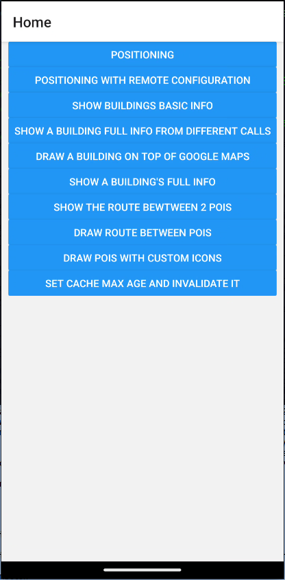
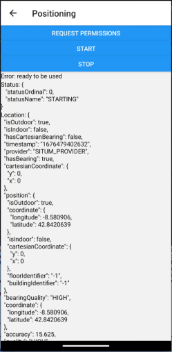
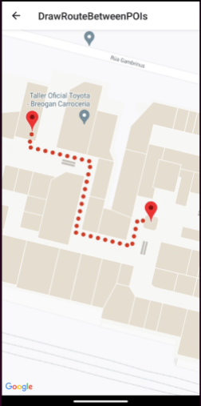

<p align="center">  <h1 align="center">Situm React Native SDK sample app</h1> </p>

<div align="center" style="text-align:center">

A sample React-Native application to start learning the power of [Situm's React Native SDK Plugin](../README.md).

</div>

<div align="center" style="text-align:center">

[](https://www.npmjs.com/package/react-native-situm-plugin) [](https://www.npmjs.com/package/react-native-situm-plugin) [](https://github.com/ellerbrock/typescript-badges/)

</div>

## Getting Started

<div align="center" style="display: flex;">
    
    
    
</div>

## What's in here <a name="whatsinhere"/>

Situm SDK is a set of utilities that allow any developer to build location based apps using Situm's indoor positioning system.
Among many other capabilities, apps developed with Situm SDK will be able to:

1. Obtain information related to buildings where Situm's positioning system is already configured:
   floor plans, points of interest, geotriggered events, etc.
2. Retrieve the location of the smartphone inside these buildings (position, orientation, and floor
   where the smartphone is).
3. Compute a route from a point A (e.g. where the smartphone is) to a point B (e.g. any point of
   interest within the building).

## How to run the app <a name="howtorun"/>

### Step 1: Install the dependencies <a name="dependencies"/>

The first step is to download this repo:

```bash
git clone https://github.com/situmtech/situm-react-native-plugin.git
```

And then install this sample app dependecies as follows:

```bash
cd example/
npm install
#OR
yarn
```

### Step 2: Set your credentials <a name="config"/>

For this step you must create a situm account, so [setup your account](../README.md#setup-your-account) before continuing.
After creating your situm account, you can set your credentials on the properties of [`src/situm.tsx`](./src/situm.tsx), like so:

```js
export const SITUM_EMAIL = '';
export const SITUM_API_KEY = '';
export const SITUM_BUILDING_ID = ''; // Identifier of the building
export const SITUM_FLOOR_ID = ''; // Identifier of the floor
```

**NOTE**: You should also fill the SITUM_BUILDING_ID and SITUM_FLOOR_ID variables so all the examples are able to work as expected. In case you haven't created POIs or paths yet, learn [how to create these cartography elements](https://situm.com/docs/sdk-cartography/#sdk-a-basic-complete-cartography-example).

### Step 3: Setup Google Maps <a name="mapsapikey"/>

You may need to configure an API KEY in order to be able to use Google Maps on your app.

Please follow steps provided on [Google Maps for iOS](https://developers.google.com/maps/documentation/ios-sdk/get-api-key?hl=en) to generate an API
Key.

**NOTE**: When generating an API key, you can restrict it to iOS & Android and use the same key for both platforms.

- **iOS**

  When you've successfully generated the key, go to [`ios/example/AppDelegate.mm`](ios/example/AppDelegate.mm) file and initialize Google Maps as shown:

```objc
#import <GoogleMaps/GoogleMaps.h>
...

- (BOOL)application:(UIApplication *)application didFinishLaunchingWithOptions:(NSDictionary *)launchOptions
{
    [GMSServices provideAPIKey:@"HERE_GOES_GOOGLE_MAPS_API_KEY"];
}
```

- **Android**

  Go to [`android/app/src/main/AndroidManifest.xml`](android/app/src/main/AndroidManifest.xml) file and add Google Maps API key as a `meta-data` inside the `application` section.

```xml
    <meta-data
        android:name="com.google.android.geo.API_KEY"
        android:value="HERE_GOES_GOOGLE_MAPS_API_KEY" />
```

### Step 4: Run the app <a name="runapplication"></a>

#### Android

- **Run from command line:** `$ react-native run-android`
- **Run from Android Studio:** Open `root/android` folder in Android Studio and run project.

#### iOS

- **Run from command line:** `$ react-native run-ios`
- **Run from XCode:** Go to `root/ios` folder and open `SitumRNGettingStarted.xcworkspace` or run command `xed ios` from root directory.

## Documentation <a name="documentation"/>

More information on how to use the official React Native plugin and the set of APIs, the functions, parameters and results each function accepts and provides can be found in our [Cordova JSDoc](https://developers.situm.com/sdk_documentation/cordova/jsdoc/latest/situm) which shares interfaces.

### Examples

In case you want to learn how to use our plugin, you may want to take a look at our code samples of the basics functionalities:

1. [**Positioning**](https://github.com/situmtech/situm-react-native-plugin/blob/feature/update-SDK-2.83.7/example/src/examples/Positioning.tsx): Learn how to start positioning and get the user location by using our listener with the specified positioning configuration inside [`src/settings.tsx`](./src/settings.tsx) file.
2. [**Positioning with Remote Configuration**](https://github.com/situmtech/situm-react-native-plugin/blob/feature/update-SDK-2.83.7/example/src/examples/RemoteConfig.tsx): Learn how to start positioning with the [remote configuration](https://situm.com/docs/sdk-remote-configuration/) defined in the settings section inside our [dashboard](https://dashboard.situm.com/settings). This way you can manage your positioning parameters with ease and avoid doing several code changes to test different configurations.
3. [**Show buildings basic info**](https://github.com/situmtech/situm-react-native-plugin/blob/feature/update-SDK-2.83.7/example/src/examples/BuildingBasicInfo.tsx): Learn how to retrieve the basic info of a building. (e.g. buildingIdentifier, name, creation date, ...)
4. [**Show a building full info from different calls**](https://github.com/situmtech/situm-react-native-plugin/blob/feature/update-SDK-2.83.7/example/src/examples/InfoFromBuilding.tsx): Learn how to retrive all the information related to a building in different calls. (e.g. floors, pois, geofences, custom fields, ...)
5. [**Draw a building in top of google maps**](https://github.com/situmtech/situm-react-native-plugin/blob/feature/update-SDK-2.83.7/example/src/examples/ShowBuildingOnMap.tsx): Draw a building above google maps.
6. [**Show a building's full info**](https://github.com/situmtech/situm-react-native-plugin/blob/feature/update-SDK-2.83.7/example/src/examples/BuildingFullInfo.tsx): Learn how to fetch all the information related to a building with just one call.
7. [**Show the route between pois**](https://github.com/situmtech/situm-react-native-plugin/blob/feature/update-SDK-2.83.7/example/src/examples/RouteBetweenPOIs.tsx): Learn how to retrieve all the info of a route between 2 pois.
8. [**Draw route between pois**](https://github.com/situmtech/situm-react-native-plugin/blob/feature/update-SDK-2.83.7/example/src/examples/DrawRouteBetweenPOIs.tsx): Learn how to draw a route between 2 pois above a floor plan.
9. [**Draw POIs with custom icons**](https://github.com/situmtech/situm-react-native-plugin/blob/feature/update-SDK-2.83.7/example/src/examples/GetPoisIcons.tsx): Learn how to display POIs with custom icons. You may need to know first how to [_create a custom POI category with custom icons_](https://situm.com/docs/cartography-management/#poi-categories).
10. [**Set cache max age and invalidate it**](https://github.com/situmtech/situm-react-native-plugin/blob/feature/update-SDK-2.83.7/example/src/examples/SetCacheMaxAge.tsx): Learn how to set the maximum cache age and how to invalidate it.

## Versioning

We use [SemVer](http://semver.org/) for versioning.

Please refer to [CHANGELOG.md](../CHANGELOG.md) for a list of notables changes for each version of the library.

You can also see the [tags on this repository](https://github.com/situmtech/situm-react-native-plugin/tags).

## Submitting Contributions <a name="contributions"/>

You will need to sign a Contributor License Agreement (CLA) before making a submission. [Learn more here.](https://situm.com/contributions/)

## License

This project is licensed under the MIT - see the [LICENSE](../LICENSE) file for details.

## More information <a name="more-info"/>

More info is available at our [Developers Page](https://situm.com/docs/01-introduction/).

## Support information <a name="support"/>

For any question or bug report, please send an email to [support@situm.es](mailto:support@situm.es)
