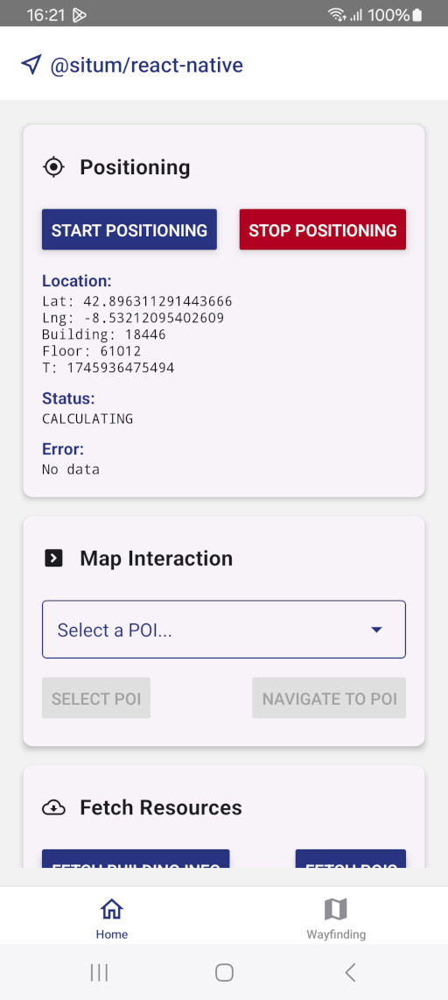

<p align="center">  <h1 align="center">Situm React Native SDK sample app</h1> </p>

<div align="center" style="text-align:center">

A sample React-Native application to start learning the power of [Situm's React Native SDK Plugin](../README.md).

</div>

<div align="center" style="text-align:center">

[](https://www.npmjs.com/package/react-native-situm-plugin) [](https://www.npmjs.com/package/react-native-situm-plugin) [](https://github.com/ellerbrock/typescript-badges/)

</div>

## Getting Started

<div align="center" style="display: flex; gap: 1rem;">
    
    
    
</div>

## What's in here <a name="whatsinhere"/>

Situm SDK is a set of utilities that allow any developer to build location based apps using Situm's indoor positioning system.
Among many other capabilities, apps developed with Situm SDK will be able to:

1. Obtain information related to buildings where Situm's positioning system is already configured:
   floor plans, points of interest, geotriggered events, etc.
2. Retrieve the location of the smartphone inside these buildings (position, orientation, and floor
   where the smartphone is).
3. Compute a route from a point A (e.g. where the smartphone is) to a point B (e.g. any point of
   interest within the building).

## How to run the app <a name="howtorun"/>

### Step 1: Install the dependencies <a name="dependencies"/>

The first step is to download this repo:

```bash
git clone https://github.com/situmtech/react-native.git
```

This repository uses [yarn workspaces](https://yarnpkg.com/features/workspaces) and [yarn 4](https://yarnpkg.com/blog/release/4.0), so you will need to install [Corepack](https://github.com/nodejs/corepack#readme) and prepare yarn:

```bash
cd react-native/
npm install -g corepack
corepack enable
corepack prepare yarn@4.0.1 --activate
```

Then install the plugin dependencies alongside the example/ app dependecies as follows:

```bash
yarn install && yarn workspace example install
```

- **iOS**
  In case you are using iOS, the last step is to install de dependencies specified in [`example/ios/Podfile`](./ios/Podfile) with:

```bash
cd ios/
pod install
```

### Step 2: Set your credentials <a name="config"/>

For this step you must create a situm account, so [setup your account](../README.md#setup-your-account) before continuing.
After creating your situm account, you must set your credentials on the properties of `src/situm.tsx`, like so:

```js
export const SITUM_EMAIL = "";
export const SITUM_API_KEY = "";
export const SITUM_BUILDING_ID = ""; // Identifier of the building to be loaded using MapView.
export const SITUM_DASHBOARD_URL = "https://api.situm.com";
```

You can use the contents of [`src/situm.tsx.example`](./src/situm.tsx.example) as example.
For security reasons, the file `situm.tsx` is ignored in this repository.

**NOTE**: You should also fill the [SITUM_BUILDING_ID](https://situm.com/docs/sdk-cartography/#building-identifier) variable so the MapView is able to work as expected. In case you haven't created POIs or paths yet, learn [how to create these cartography elements](https://situm.com/docs/sdk-cartography/#sdk-a-basic-complete-cartography-example).

### Step 3: Run the app <a name="runapplication"></a>

#### Android

- **Run from command line:**

  1. Initialize the metro terminal with `$ yarn workspace example start`.
  2. Then (in another terminal) compile and run this app in your device with `$ yarn example android`.

- **Run from Android Studio:** Open `example/android` folder in Android Studio and run project.

#### iOS

- **Run from command line:**

  1. Initialize the metro terminal with `$ yarn workspace example start`
  2. Then (in another terminal) compile and run this app in your device with `$ yarn example ios`.

- **Run from XCode:** Go to `example/ios` folder and open `SitumReactNativeExample.xcworkspace`.

## Documentation <a name="documentation"/>

More information on how to use the official React Native plugin and the set of APIs, the functions, parameters and results each function accepts and provides can be found in our [Cordova JSDoc](https://developers.situm.com/sdk_documentation/cordova/jsdoc/latest/situm) which shares interfaces.

### Examples

In case you want to learn how to use our plugin, you may want to take a look at our code samples of the basics functionalities:

- **Showcasing our SDK**
  - [**HomeScreen**](./src/screens/HomeScreen.tsx)
    - **Positioning**: Learn how to start positioning and get the user location by using our listener.
    - **Map Interaction**: Learn how to interact with `MapView` from a different screen.
    - **Fetch Resources**: Learn how to fetch information about Situm cartography elements, such as buildings, POIs, and geofences.
  - [**WayfindingScreen**](./src/screens/WayfindingScreen.tsx)
    - **MapView**: Learn how to integrate `MapView` for a complete wayfinding experience.
    - Learn how to interact with the map, such as selecting a POI or starting navigation.

## Versioning

We use [SemVer](http://semver.org/) for versioning.

Please refer to [CHANGELOG.md](../CHANGELOG.md) for a list of notables changes for each version of the library.

You can also see the [tags on this repository](https://github.com/situmtech/situm-react-native-plugin/tags).

## Submitting Contributions <a name="contributions"/>

You will need to sign a Contributor License Agreement (CLA) before making a submission. [Learn more here.](https://situm.com/contributions/)

## License

This project is licensed under the MIT - see the [LICENSE](../LICENSE) file for details.

## More information <a name="more-info"/>

More info is available at our [Developers Page](https://situm.com/docs/01-introduction/).

## Support information <a name="support"/>

For any question or bug report, please send an email to [support@situm.es](mailto:support@situm.es)
